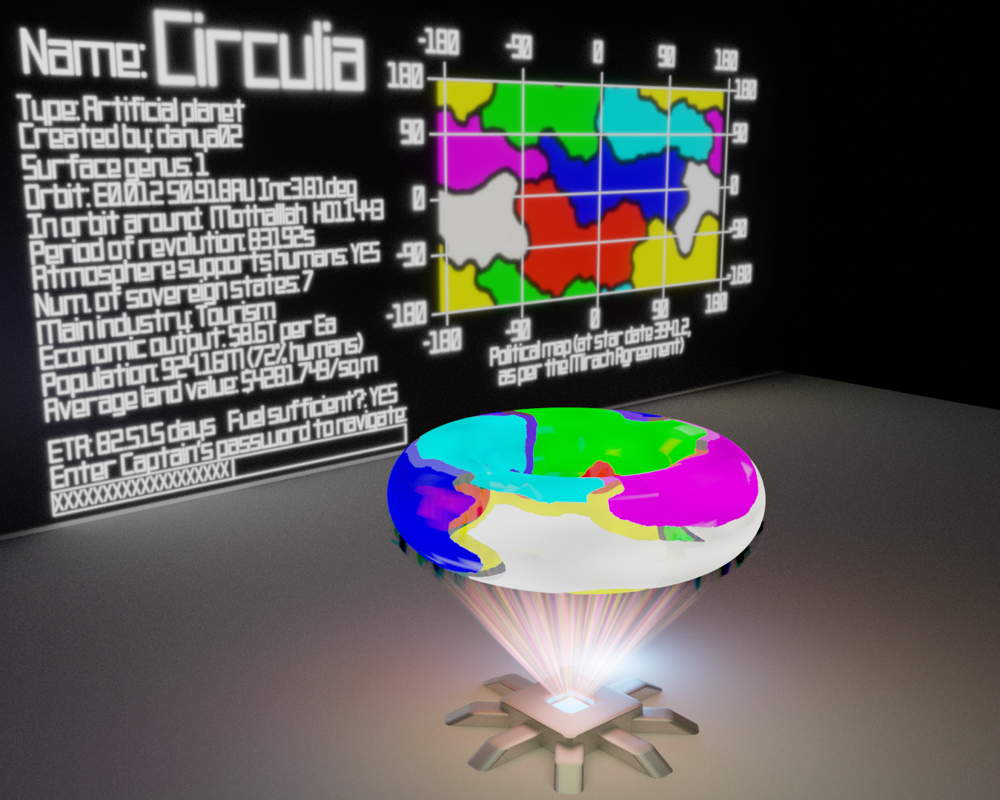

# TL;DR: [this file](render.png)

AKA "Bring Your Own Planet".

This is the second time there's been a surface-coloring task at Slon.
I was aware of the fact that it is impossible to color a torus into more than 7 segments in this way, but I didn't know how it could be done.

Thankfully Blender provides the excellent Texture Paint feature, which allowed me to sketch on a surface of a torus, as well as (using the fact that a plane rolled into a cylinder, with the ends joined together, is a torus) on the surface of the torus's net in the image editor.

Thanks to [PGmath at the Blender SE](https://blender.stackexchange.com/a/57555) for the god-ray node graph, [Michael Moss](https://whitespirals.com/) for the font, and to my mom for artistic guidance, as well as drawing the map you see from my crude sketch of how it should be done (not included, because it's really painful to look at).
